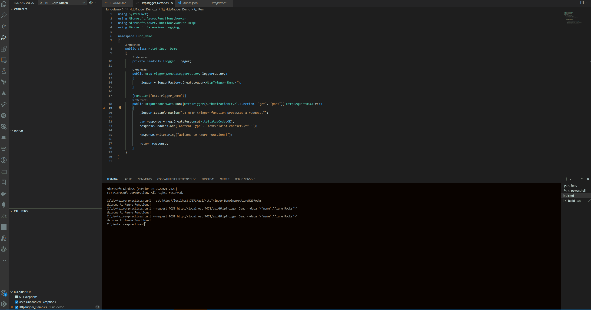

# AZURE DEMO

## Tech Stack

-[x] Azure Function

```c#
$ func init func-demo --worker-runtime dotnet-isolated

$ cd func-demo

$ func new --template "Http Trigger" --name HttpTrigger-Demo

$ func new --template "Azure Queue Storage Trigger" --name QueueTrigger-Demo

$ func start

$ curl --get http://localhost:7071/api/HttpTrigger_Demo?name=JeffTest

$ curl --request POST http://localhost:7071/api/MyHttpTrigger --data '{"name":"Jeff Test"}'

```

## Debug


